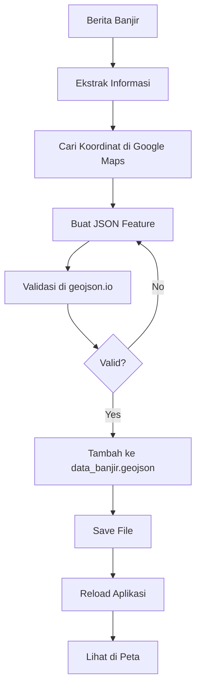

# PANDUAN MENAMBAHKAN DATA BANJIR (FORMAT GEOJSON)

## 🎯 Mengapa GeoJSON?

✅ **Konsisten dengan metodologi** - Semua data spasial menggunakan format GIS standar  
✅ **Koordinat terintegrasi** - Tidak perlu hardcode koordinat di kode JavaScript  
✅ **Standar OGC** - Format GeoJSON adalah standar Open Geospatial Consortium  
✅ **Lebih profesional** - Sesuai dengan best practice web GIS  

---

## 📋 Format GeoJSON

File: `public/data/data_banjir.geojson`

### Struktur Dasar:

```json
{
  "type": "FeatureCollection",
  "crs": {
    "type": "name",
    "properties": {
      "name": "urn:ogc:def:crs:OGC:1.3:CRS84"
    }
  },
  "features": [
    {
      "type": "Feature",
      "geometry": {
        "type": "Point",
        "coordinates": [longitude, latitude]
      },
      "properties": {
        // semua atribut data
      }
    }
  ]
}
```

---

## 📍 Cara Menambahkan Data dari Berita

### **Langkah 1: Siapkan Informasi**

Dari berita, catat:
- ✅ Lokasi kejadian (Kecamatan/alamat spesifik)
- ✅ Jumlah titik banjir
- ✅ Tanggal/tahun kejadian
- ✅ Koordinat (latitude, longitude)

### **Langkah 2: Cari Koordinat**

**Metode A: Google Maps**
1. Buka https://www.google.com/maps
2. Cari lokasi kejadian
3. Klik kanan → klik koordinat untuk copy
4. Format: `-6.2784, 106.9771` (latitude, longitude)

**Metode B: Geocoding Online**
- https://www.latlong.net/
- https://nominatim.openstreetmap.org/

### **Langkah 3: Tambahkan ke GeoJSON**

Buka file: `Project/public/data/data_banjir.geojson`

#### Template Feature Baru:

```json
{
  "type": "Feature",
  "geometry": {
    "type": "Point",
    "coordinates": [LONGITUDE, LATITUDE]  ← PERHATIKAN: [lng, lat] bukan [lat, lng]!
  },
  "properties": {
    "id": [ID_BARU],
    "kode_provinsi": "32",
    "nama_provinsi": "JAWA BARAT",
    "bps_kode_kabupaten_kota": "3275",
    "bps_nama_kabupaten_kota": "KOTA BEKASI",
    "bps_kode_kecamatan": "[KODE]",
    "bps_nama_kecamatan": "[NAMA_KECAMATAN]",
    "kemendagri_kode_kecamatan": "[KODE_KEMENDAGRI]",
    "kemendagri_nama_kecamatan": "[NAMA_KECAMATAN]",
    "lokasi_kejadian_kecamatan": "[Nama Kecamatan]",
    "kecamatan": "[NAMA_KECAMATAN_KAPITAL]",
    "nama_kecamatan": "[NAMA_KECAMATAN]",
    "jumlah_titik_banjir": [JUMLAH],
    "masa_tanggap_darurat_hari": 14,
    "satuan": "BENCANA/BANJIR",
    "tahun": [TAHUN],
    "severity": "[low/medium/high]"
  }
}
```

---

## 📝 Contoh Praktis

### Berita:
> "Banjir melanda Perumahan Jatibening Permai, Kel. Jatibening, Kec. Pondok Melati pada 24 Feb 2026. 
> 2 titik tergenang setinggi 80 cm. Koordinat: -6.3074, 106.9869"

### Data GeoJSON:

```json
{
  "type": "Feature",
  "geometry": {
    "type": "Point",
    "coordinates": [106.9869, -6.3074]  
  },
  "properties": {
    "id": 19,
    "kode_provinsi": "32",
    "nama_provinsi": "JAWA BARAT",
    "bps_kode_kabupaten_kota": "3275",
    "bps_nama_kabupaten_kota": "KOTA BEKASI",
    "bps_kode_kecamatan": "3275012",
    "bps_nama_kecamatan": "PONDOKMELATI",
    "kemendagri_kode_kecamatan": "32.75.12",
    "kemendagri_nama_kecamatan": "PONDOKMELATI",
    "lokasi_kejadian_kecamatan": "PondokMelati",
    "kecamatan": "PONDOKMELATI",
    "nama_kecamatan": "PONDOKMELATI",
    "jumlah_titik_banjir": 2,
    "masa_tanggap_darurat_hari": 14,
    "satuan": "BENCANA/BANJIR",
    "tahun": 2026,
    "severity": "low"
  }
}
```

### Cara Memasukkan:

1. Buka `public/data/data_banjir.geojson`
2. Scroll ke bagian akhir array `features`
3. Sebelum `]` (tutup array), tambahkan koma `,` setelah feature terakhir
4. Paste feature baru
5. Save file

**PENTING:** Pastikan format JSON valid (pakai koma dengan benar, jangan ada koma di element terakhir)

---

## 🎨 Kategori Severity

Sistem menentukan warna marker otomatis berdasarkan `jumlah_titik_banjir`:

| Severity | Jumlah Titik | Warna | Kode |
|----------|--------------|-------|------|
| **Low** | < 12 | 🟢 Hijau | `"low"` |
| **Medium** | 12-19 | 🟡 Kuning | `"medium"` |
| **High** | ≥ 20 | 🔴 Merah | `"high"` |

Isi field `severity` sesuai tabel di atas.

---

## ⚠️ PENTING - GeoJSON Coordinates

**GeoJSON menggunakan format [LONGITUDE, LATITUDE]** ← Terbalik dari urutan biasa!

```json
// ❌ SALAH
"coordinates": [-6.2784, 106.9771]  // ini [lat, lng] - SALAH!

// ✅ BENAR
"coordinates": [106.9771, -6.2784]  // ini [lng, lat] - BENAR!
```

**Tips:** 
- Longitude (X-axis) = Bujur = angka ~107 (untuk Bekasi)
- Latitude (Y-axis) = Lintang = angka ~-6 (untuk Bekasi)

---

## 🔧 Validasi GeoJSON

### Online Validator:
- https://geojsonlint.com/
- https://geojson.io/ (dengan visualisasi peta)

### Cara Validasi:
1. Copy seluruh isi `data_banjir.geojson`
2. Paste ke geojson.io
3. Lihat apakah titik muncul di peta Bekasi
4. Perbaiki jika ada error

---

## 📊 Kode Kecamatan Bekasi

| Kecamatan | BPS Kode | Kemendagri Kode |
|-----------|----------|------------------|
| PONDOKGEDE | 3275010 | 32.75.08 |
| JATISAMPURNA | 3275011 | 32.75.10 |
| PONDOKMELATI | 3275012 | 32.75.12 |
| JATIASIH | 3275020 | 32.75.09 |
| BANTARGEBANG | 3275030 | 32.75.07 |
| MUSTIKAJAYA | 3275031 | 32.75.11 |
| BEKASI TIMUR | 3275040 | 32.75.01 |
| RAWALUMBU | 3275041 | 32.75.05 |
| BEKASI SELATAN | 3275050 | 32.75.04 |
| BEKASI BARAT | 3275060 | 32.75.02 |
| MEDANSATRIA | 3275061 | 32.75.06 |
| BEKASI UTARA | 3275070 | 32.75.03 |

---

## 🚀 Workflow Lengkap



---

## 📄 File Terkait

1. **Data Banjir**: `public/data/data_banjir.geojson` ← Edit file ini
2. **Data Drainase**: `public/data/export.geojson` ← Dari konversi .shp
3. **Kode Utama**: `src/MapDashboard.jsx` ← Tidak perlu diubah

---

## 💡 Tips & Best Practices

### 1. **Gunakan Editor JSON**
- Visual Studio Code dengan extension "JSON Tools"
- Auto-format: `Shift+Alt+F`

### 2. **Backup Data**
Sebelum edit, selalu backup:
```bash
cp data_banjir.geojson data_banjir.geojson.backup
```

### 3. **Konsistensi Field**
- `kecamatan`: KAPITAL SEMUA
- `nama_kecamatan`: CamelCase atau normal
- `tahun`: integer (2026, bukan "2026")
- `jumlah_titik_banjir`: integer

### 4. **Koordinat Akurat**
- Gunakan koordinat spesifik dari Google Maps, bukan centroid kecamatan
- Zoom ke lokasi detail sebelum ambil koordinat

### 5. **Testing**
Setelah tambah data:
```bash
# Reload browser dengan hard refresh
Ctrl + Shift + R (Windows)
Cmd + Shift + R (Mac)
```

---

## ❓ Troubleshooting

### Error: "Unexpected token" saat load aplikasi
→ Cek syntax JSON, kemungkinan ada koma yang salah

### Titik tidak muncul di peta
→ Cek koordinat, pastikan format [lng, lat] benar

### Titik muncul di lokasi yang salah
→ Koordinat terbalik, swap latitude & longitude

### Data tidak update
→ Hard refresh browser (Ctrl+Shift+R)

---

## 🎓 Untuk Metodologi Skripsi

**Format Data:**
> "Data kejadian banjir dikumpulkan dari berbagai sumber (BNPB, media massa, laporan instansi) 
> kemudian dikonversi ke format GeoJSON dengan menambahkan informasi koordinat geografis 
> untuk setiap titik kejadian. Format GeoJSON dipilih karena merupakan standar OGC (Open 
> Geospatial Consortium) yang kompatibel dengan library Leaflet.js dan memungkinkan 
> integrasi seamless antara data tabular dan data spasial."

**Keunggulan:**
- ✅ Format standar internasional (RFC 7946)
- ✅ Koordinat terintegrasi dengan atribut
- ✅ Mendukung berbagai tipe geometri (Point, LineString, Polygon)
- ✅ Human-readable (JSON)
- ✅ Native support di Leaflet.js

---

## 📚 Referensi

- **GeoJSON Spec**: https://geojson.org/
- **RFC 7946**: https://tools.ietf.org/html/rfc7946
- **Leaflet GeoJSON**: https://leafletjs.com/reference.html#geojson
- **EPSG:4326 (WGS84)**: https://epsg.io/4326

---

**Happy Mapping! 🗺️**
